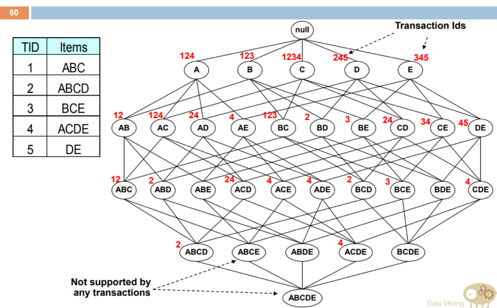
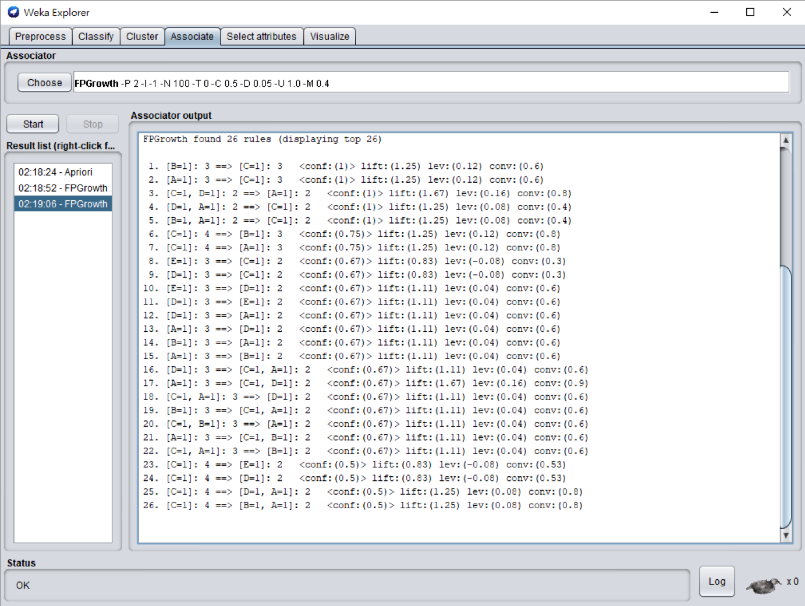
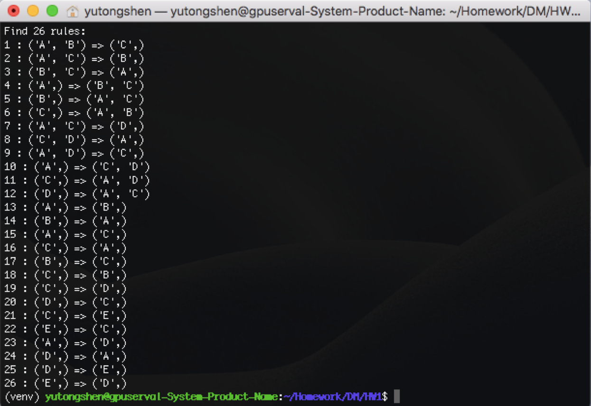
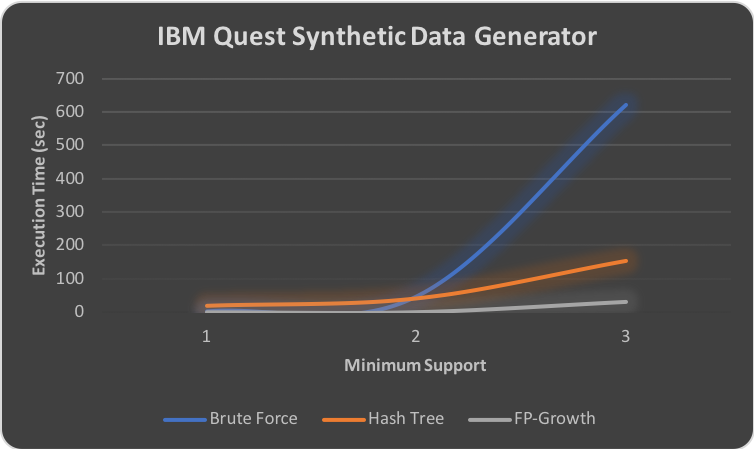
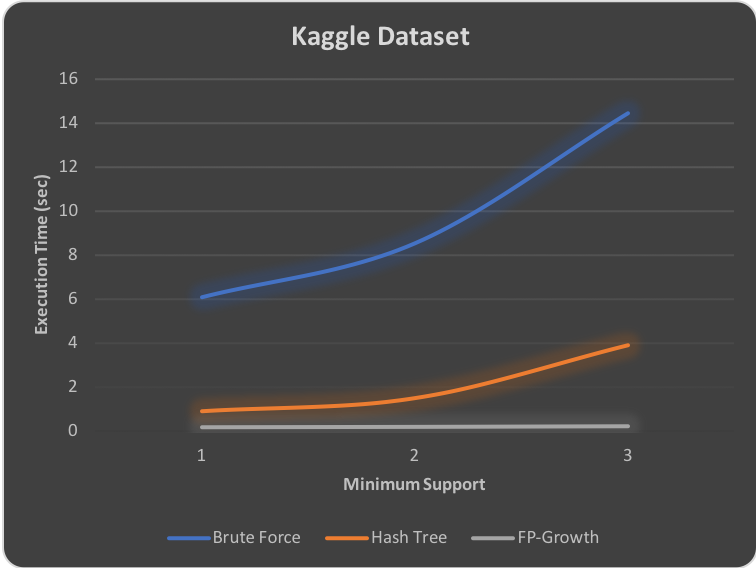

# Data Mining
## Association Analysis
## Environment
- Ubuntu 18.04.1 LTS (GNU/Linux 4.15.0-34-generic x86\_64)

## Prerequisite
- Python 3.6.4
- g++ 5.5.0

## Makefile
- Compile program
```shell=
$ make
```

- Compile and execute program
```shell=
$ make run
```

## Usage
```shell=
$ python main.py [-h] [-m METHOD {brute|hash|fp}] [-t TRANSATION_FILE] 
                 [-ms MIN_SUPPORT] [-mc MIN_CONFIDENCE]
                 [-a PRINT_ASSOCIATE {true|false}]
```

| optional Options   | Description                          |
| ---                | ---                                  |
| -h, --help         | show this help message and exit      |
| -m METHOD          | Algorithm select. (default:fp)       |
| -t TRANSATION\_FILE | Import transaction file              |
| -ms MIN\_SUPPORT    | Set minimum support (default:3)      |
| -mc MIN\_CONFIDENCE | Set minimum confidence (default:0.5) |
| -a PRINT\_ASSOCIATE | Show association rule {true\|false}   |

## Files Structure
```
.
+-- include
|   +-- FPTree.hpp
|   +-- HashTree.hpp
|   +-- IntList.hpp
+-- lib
|   +-- libCArray.so
|   +-- libFPTree.so
|   +-- libHashTree.so
+-- data
|   +-- Test.csv
|   +-- IBM_data.txt
|   +-- BreadBasket_DMS.csv
+-- CArray
|   +-- CAarry.cpp
|   +-- IntList.cpp
+-- HashTree
|   +-- HashTree.cpp
+-- FPTree
|   +-- FPTree.cpp
+-- Makefile
+-- ArrayConvert.py
+-- Apriori.py
+-- CountMethod.py
+-- DataReader.py
+-- main.py
```
- `include/FPTree.hpp`: FP-Growth物件prototype宣告
- `include/HashTree.hpp`: Hash Tree物件prototype宣告
- `include/IntList.hpp`: IntList物件prototype宣告，用來接收python傳送之list資料結構，其物件內主要為陣列用來儲存list的各個元素，並儲存list長度
- `lib/`: 編譯完之.so檔(library)，當python程式運行時將會引入這些library
- `data/Test.csv`: 本次實驗輸入資料，為驗證本程式與Weka輸出結果一致之測試使用
- `data/IBM_data.txt`: 本次實驗輸入資料，是由IBM Quest Synthetic Data Generator產生之資料
- `data/BreadBasket_DMS.csv`: 本次實驗輸入資料，是由Kaggle平台上公開提供之資料
- `CArray/CAarry.cpp`: CArray物件實作，並建立python調用介面
- `CArray/IntList.cpp`: IntList物件實作
- `HashTree/HashTree.cpp`: Hash Tree物件實作，並建立python調用介面
- `FPTree/FPTree.cpp`: FP-Growth物件實作，並建立python調用介面
- `Makefile`: 自動編譯C++ source code產生library並放置在，lib/目錄底下
- `ArrayConvert.py`: 整合python list與C++ IntList物件轉換介面
- `Apriori.py`: 建立Apriori物件，整合brute force、hash tree及FP-Growth方法，並能輸出frequent itemset
- `CountMethod.py`: 實作brute force方法及調用libHashTree.so建構hash tree方法
- `DataReader.py`: 實作讀取輸入檔案介面
- `main.py`: 主程式

## Architecture
- 實作Apriori暴力法、hash tree搜尋support值以及FP-Growth方法直接找出frequent itemset。
- 其中暴力法為逐筆transaction循序搜尋下去，如果比對candidate成功便會將其support值加一，這是裡面最緩慢的方法。
- Hash tree部分，為採用C\++來實作，將C\++程式碼編譯成library，再透過python引入使用，其實作的hash function為h(x) = x % 3，因此每個節點都可以有3棵子樹，因此搜尋candidate時便可以透過hash function的配對排除其他不必要的搜尋，另外hash tree部分有實作純python版本，但效果沒有C\++實作出來的好，因此只展示C++的部分。
- FP-Growth部分，為三種方法裡面最為迅速的方法，也是採用C++來實作，不論minimum support設定多低，都有非常好的表現，迅速地找出Frequent itemset

## Verification
- 由於在大量數據的association rules並不會依照固定順序排列，再比對上有些難度，所以就採用上課投影片比較簡單的transaction，限制minimum support為0.4（2 instance）、minimum confidence為0.5，使用Weka產生association rules，再比對這次作業程式輸出的association rules，確認結果一致

  |  TID  | Items |
  | :---: | :---: |
  |   1   |  ABC  |
  |   2   |  ABCD |
  |   3   |  BCE  |
  |   4   |  ACDE |
  |   5   |  DE   |

  
  > Source: 上課投影片

  
  > Weka輸出結果

  
  > 本程式輸出結果
 
## Comparison
- Find frequent itemset
  - IBM data (./data/IBM\_data.txt)
  
    | Condition                                  |       |
    | ---                                        | :---: |
    | Number of items                            |  9969 |
    | Number of transactions                     |  984  |


  - Execution time
    - Minimum support: 2

    |   Method    |      Time     |
    | ---         | ---           |
    | Brute Force | 10 m 22.637 s |
    |  Hash Tree  |  2 m 32.743 s |
    |  FP-Growth  |  0 m 31.521 s |
  
    - Minimum support: 3

    |   Method    |      Time     |
    | ---         | ---           |
    | Brute Force |  0 m 47.572 s |
    |  Hash Tree  |  0 m 41.402 s |
    |  FP-Growth  |  0 m  0.450 s |

    - Minimum support: 4

    |   Method    |      Time     |
    | ---         | ---           |
    | Brute Force |  0 m  2.966 s |
    |  Hash Tree  |  0 m 19.487 s |
    |  FP-Growth  |  0 m  0.064 s |
  ---
  - Kaggle data (./data/BreadBasket\_DMS.csv)
  
    | Condition                                  |       |
    | ---                                        | :---: |
    | Number of items                            | 21294 |
    | Number of transactions                     |  9684 |


  - Execution time
    - Minimum support: 2

    |   Method    |      Time     |
    | ---         | ---           |
    | Brute Force |  0 m 14.451 s |
    |  Hash Tree  |  0 m  3.875 s |
    |  FP-Growth  |  0 m  0.197 s |
  
    - Minimum support: 3

    |   Method    |      Time     |
    | ---         | ---           |
    | Brute Force |  0 m  8.521 s |
    |  Hash Tree  |  0 m  1.486 s |
    |  FP-Growth  |  0 m  0.183 s |

    - Minimum support: 4

    |   Method    |      Time     |
    | ---         | ---           |
    | Brute Force |  0 m  6.061 s |
    |  Hash Tree  |  0 m  0.893 s |
    |  FP-Growth  |  0 m  0.174 s |

## Conclusion
- 本實驗是以IBM Quest Synthetic Data Generator所產生的資料及Kaggle上開放的dataset來作程式運行效能的評估。
- 由Coding的過程中，能感受到python與C\+\+程式的效率差異，尤其是在樹狀資料結構，C\+\+能夠更精準明確地使用指標來操作樹走訪，對於記憶體資源使用也比較能控制，因此實作出來的效率遠高於python的效率，經過實際比較，一樣是單純建構hash tree，python執行所需時間約為C\+\+之5倍，因此本程式在運算複雜的地方，都會改用C\+\+來實作，以達成最好的效果。

  
  > IBM Quest Synthetic Data Generator
  
  
  > Kaggle dataset (Bread Basket)

- 隨著minimum support的下降，可以見到程式運行時間會越來越大幅度成長，尤其是brute force方法最為明顯，也因此brute force雖然coding想法容易，但只要資料量大或是minimum support低的狀況下，並不是一個好的做法。反觀FP-Growth，因為是使用全部的transaction來建構FP tree，因此對於低minimum support的環境下影響不大，比較下來也是這之中最好的做法。

## Authors
[Yu-Tong Shen](https://github.com/yutongshen/)
